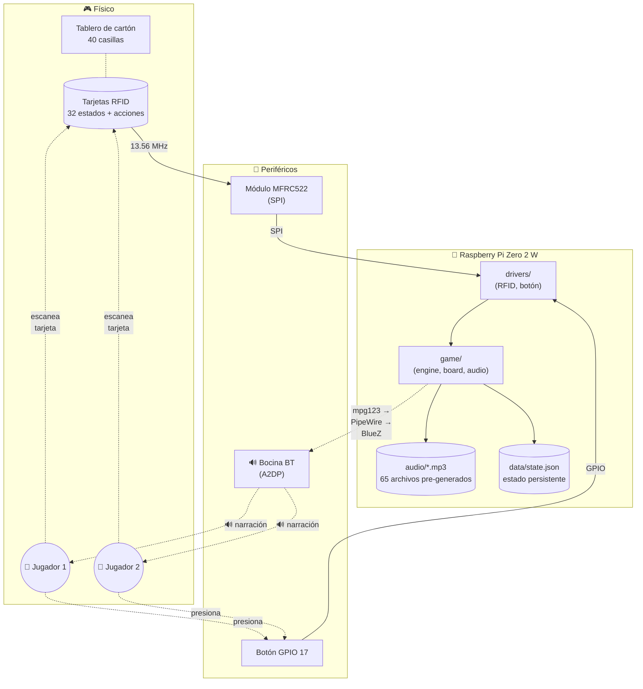
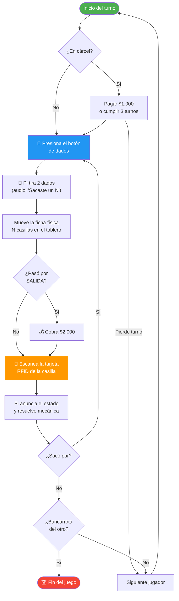

# Turista Mundial Azteca

Juego de mesa didáctico de los 32 estados de México implementado en una Raspberry Pi Zero 2 W con narración por voz en español, lector RFID por casilla y botón físico para los dados.

> **Estado:** MVP completo y jugable en modo consola. Drivers de hardware plug-and-play listos para tarjetas RFID y botón físico cuando se ensamble el tablero.

---

## Tabla de contenidos

- [¿Qué es?](#qué-es)
- [Características](#características)
- [Demo rápido](#demo-rápido)
- [Hardware necesario](#hardware-necesario)
- [Diagrama del sistema](#diagrama-del-sistema)
- [Instalación](#instalación)
- [Cómo jugar](#cómo-jugar)
- [Estructura del proyecto](#estructura-del-proyecto)
- [Documentación completa](#documentación-completa)
- [Stack tecnológico](#stack-tecnológico)
- [Licencia y créditos](#licencia-y-créditos)

---

## ¿Qué es?

Una versión del clásico juego de mesa **Turista** ambientada en los 32 estados de México, pensada como herramienta educativa para que niños y familias aprendan geografía mexicana mientras juegan. Toda la mecánica clásica (compra-venta de propiedades, renta, cárcel, cartas de fortuna) se conserva, pero **la Pi narra el juego en voz alta** y el tablero físico se interactúa con tarjetas RFID.

## Características

- 🎲 **2 jugadores** con turnos alternados, dados aleatorios
- 🗺️ **Tablero de 40 casillas** con los 32 estados ordenados geográficamente (Sur → Este → Norte → Oeste)
- 🔊 **65 audios pre-generados** en voz `es-MX-DaliaNeural` y `es-MX-JorgeNeural` (Microsoft Edge TTS)
- 📡 **Lector RFID MFRC522** para identificar jugadores, casillas y acciones
- 🔘 **Botón físico GPIO** para tirar los dados
- 🎵 **Bocina Bluetooth** para audio inalámbrico (sin cables al tablero)
- 💾 **Persistencia automática**: las partidas se guardan entre turnos y se reanudan si se interrumpen
- 🔌 **Plug-and-play**: sin hardware conectado el juego corre completo en modo consola

## Demo rápido

```bash
# Con audio + hardware autodetectado:
python -m game.main

# Modo consola pura (debug, sin BT/RFID/GPIO):
python -m game.main --console-only

# Stress test (50 turnos automáticos):
python -m game.main --no-audio --auto 50 --reset
```

---

## Hardware necesario

| Componente | Modelo / Especificación | Cant. | Precio aprox. (MXN) | Notas |
|---|---|:-:|---:|---|
| **Raspberry Pi Zero 2 W** | con headers GPIO soldados | 1 | $400 – 700 | Cerebro del juego |
| **microSD** | 16 GB clase 10 mínimo | 1 | $100 – 200 | Para Raspberry Pi OS Lite 64-bit |
| **Fuente de poder** | 5 V / 2.5 A microUSB | 1 | $150 – 250 | Oficial recomendada |
| **Bocina Bluetooth** | cualquier marca con A2DP | 1 | $200 – 800 | Probado con Mobo Vibe |
| **Módulo RFID** | MFRC522 (RC522) 13.56 MHz | 1 | $80 – 150 | Incluye 1 tarjeta + 1 llavero típicamente |
| **Tarjetas RFID** | 13.56 MHz MIFARE Classic 1K | 40+ | $200 – 400 | 32 estados + 8 acciones/jugadores |
| **Botón pulsador** | momentáneo NA (normalmente abierto) | 1 | $20 – 50 | Para los dados |
| **Cables jumper** | hembra-hembra (Pi ↔ MFRC522) | 7 | $50 – 100 | Pack mixto sirve |
| **Cables jumper** | hembra-macho (Pi ↔ botón) | 2 | — | Del mismo pack |
| **Tablero físico** | cartón / triplay 60×60 cm | 1 | $50 – 300 | DIY o impreso |
| **Fichas y dinero** | de cualquier Turista clásico | — | reciclado | Opcional |
| **Total estimado** | | | **$1,250 – 2,950** | Sin contar el tablero impreso |

> 💡 Detalles, links de compra y diagramas de cableado en **[docs/HARDWARE.md](docs/HARDWARE.md)**.

---

## Diagrama del sistema



---

## Instalación

### 1. Preparar la Raspberry Pi

```bash
# Sobre Raspberry Pi OS Lite 64-bit
sudo apt update && sudo apt upgrade -y
sudo apt install -y \
  git python3-pip python3-venv python3-gpiozero python3-lgpio \
  bluez bluez-tools pulseaudio pulseaudio-module-bluetooth \
  mpg123 alsa-utils build-essential

# Habilitar SPI (para MFRC522)
sudo raspi-config nonint do_spi 0

# Tu usuario debe estar en estos grupos
sudo usermod -aG bluetooth,audio,spi,gpio,i2c $USER
```

### 2. Clonar el proyecto

```bash
git clone https://github.com/<tu-usuario>/turista.git ~/turista
cd ~/turista
```

### 3. Crear el entorno virtual (con system-site-packages para `gpiozero`)

```bash
python3 -m venv .venv --system-site-packages
source .venv/bin/activate
pip install edge-tts pygame mfrc522 spidev pydub
```

### 4. Configurar la bocina Bluetooth

Empareja con `bluetoothctl`:

```bash
bluetoothctl
> power on
> agent on
> scan on
# (anota el MAC de tu bocina cuando aparezca)
> pair AA:BB:CC:DD:EE:FF
> trust AA:BB:CC:DD:EE:FF
> connect AA:BB:CC:DD:EE:FF
> quit
```

Luego edita `scripts/connect-mobo.sh` y cambia `MAC="..."` por la de tu bocina, después:

```bash
mkdir -p ~/.config/systemd/user
cp scripts/connect-mobo.service ~/.config/systemd/user/
systemctl --user daemon-reload
systemctl --user enable connect-mobo.service
sudo loginctl enable-linger $USER   # arranca al boot sin SSH login
```

### 5. Generar los audios TTS (la primera vez)

```bash
python scripts/generate_tts.py
# Genera 65 archivos en audio/  (~2 MB total)
```

### 6. Probar el sistema

```bash
~/turista/scripts/verify-bt.sh   # valida bocina + audio
python -m game.main --console-only --reset --auto 10  # valida lógica
python -m game.main              # juega
```

---

## Cómo jugar

Resumen del flujo:



📖 **Guía completa con reglas, cartas de fortuna, mecánica de cárcel y estrategias: [docs/PLAY.md](docs/PLAY.md)**

---

## Estructura del proyecto

```
turista/
├── README.md                  ← este archivo
├── docs/
│   ├── PLAY.md                ← guía de cómo jugar
│   ├── HARDWARE.md            ← compras + cableado
│   └── ARCHITECTURE.md        ← arquitectura técnica
│
├── game/                      ← lógica del juego (Python puro)
│   ├── __init__.py
│   ├── config.py              ← parámetros: $30K inicial, ×10 compra, etc.
│   ├── models.py              ← dataclasses: Casilla, Jugador, Tablero, Juego
│   ├── board.py               ← construye el tablero de 40 casillas
│   ├── engine.py              ← state machine: turnos, eventos, bancarrota
│   ├── audio.py               ← reproductor mp3 con cola asíncrona
│   ├── state_store.py         ← persistencia data/state.json
│   └── main.py                ← CLI runnable (HardwareIO + ConsoleIO + AutoIO)
│
├── drivers/                   ← interfaz a hardware (plug-and-play)
│   ├── __init__.py
│   ├── dice_button.py         ← botón GPIO 17 (gpiozero + lgpio)
│   ├── rfid_reader.py         ← lector MFRC522 (mfrc522 lib)
│   └── rfid_registry.py       ← mapeo persistente UID → entidad
│
├── data/
│   ├── phrases.py             ← 64 frases del juego + 32 estados con precios
│   ├── rfid_cards.json        ← UIDs registrados (se llena con register_card.py)
│   └── state.json             ← estado de la partida actual (ignorado por git)
│
├── audio/                     ← 65 mp3 generados (ignorados por git, se regeneran)
│
├── scripts/
│   ├── generate_tts.py        ← genera los 65 mp3 desde phrases.py
│   ├── register_card.py       ← CLI para registrar tarjetas nuevas
│   ├── connect-mobo.sh        ← auto-conexión bocina BT al arrancar
│   ├── connect-mobo.service   ← (en ~/.config/systemd/user/)
│   └── verify-bt.sh           ← valida bocina + audio funcionando
│
└── .venv/                     ← entorno virtual (ignorado, recrear con install)
```

---

## Documentación completa

| Documento | Para quién | Contiene |
|---|---|---|
| **[docs/PLAY.md](docs/PLAY.md)** | Jugadores y maestros | Reglas, cartas de fortuna, cárcel, estrategias, FAQ |
| **[docs/HARDWARE.md](docs/HARDWARE.md)** | Quien va a ensamblar | Compras detalladas, cableado pin-por-pin, ensamblado, calibración |
| **[docs/ARCHITECTURE.md](docs/ARCHITECTURE.md)** | Desarrolladores | Diagramas de módulos, audio pipeline, RFID flow, cómo extender |

---

## Stack tecnológico

| Capa | Tecnología |
|---|---|
| **Hardware** | Raspberry Pi Zero 2 W (ARM64), MFRC522 (RFID 13.56 MHz), Bluetooth A2DP |
| **OS** | Raspberry Pi OS Lite 64-bit (Bookworm/Trixie), kernel 6.x |
| **Audio** | PipeWire + WirePlumber + BlueZ + mpg123 |
| **TTS** | Microsoft Edge TTS (es-MX-DaliaNeural, es-MX-JorgeNeural) |
| **GPIO** | gpiozero (backend lgpio) |
| **RFID** | python `mfrc522` library + SPI |
| **Lenguaje** | Python 3.13, sin dependencias pesadas |
| **Persistencia** | JSON plano (`data/state.json`, `data/rfid_cards.json`) |

---

## Licencia y créditos

Proyecto desarrollado por **[Tu nombre]**, originalmente como proyecto escolar/familiar.

**Licencia:** _por definir_ (recomendado: [MIT](https://choosealicense.com/licenses/mit/) para uso libre).

**Voces TTS:** generadas con [`edge-tts`](https://github.com/rany2/edge-tts) (Microsoft Edge cloud TTS, uso personal).

**Inspiración:** Juego de mesa _Turista Mundial_ de México (genérico, dominio cultural).
