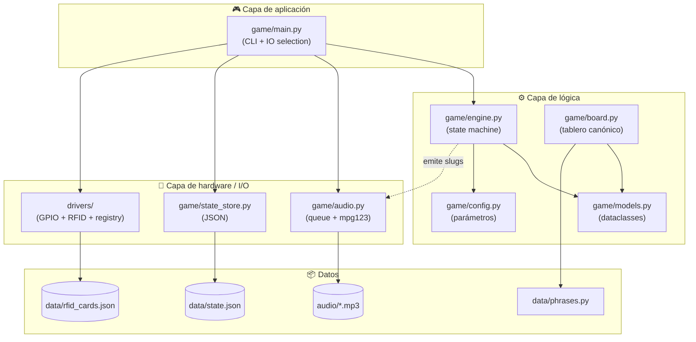
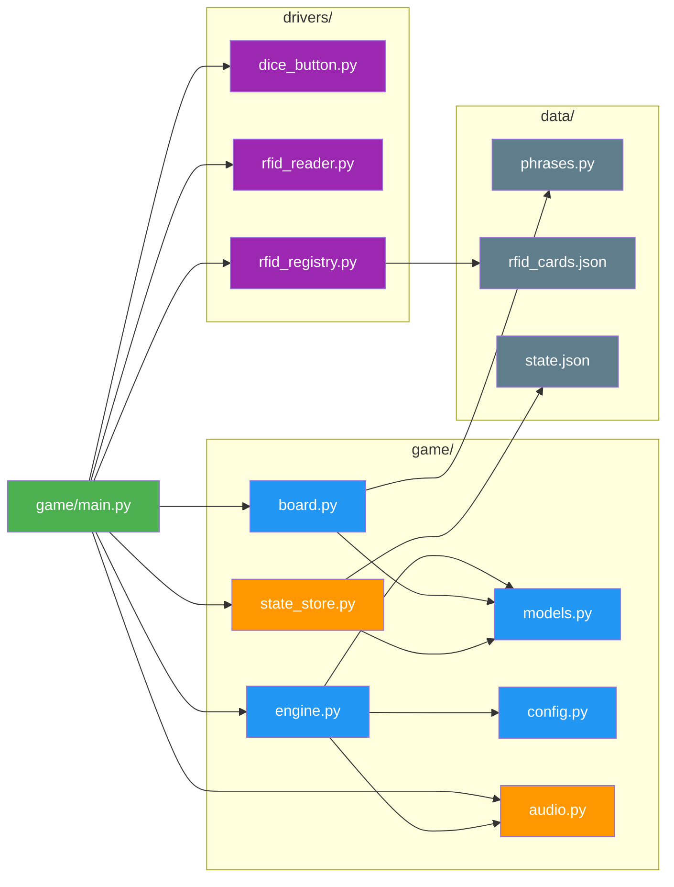
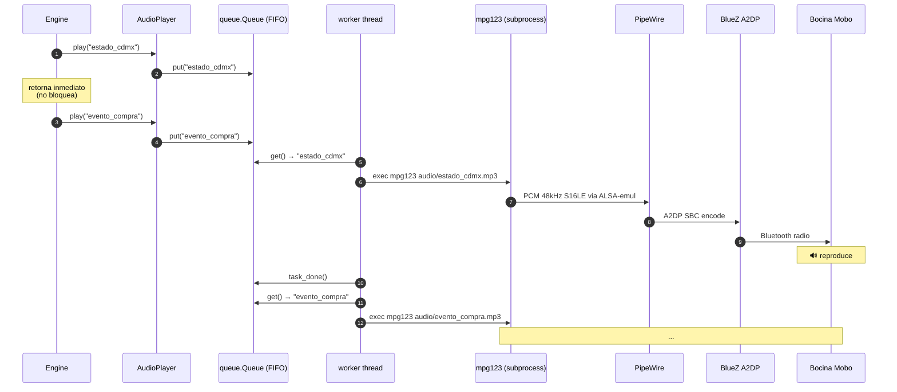
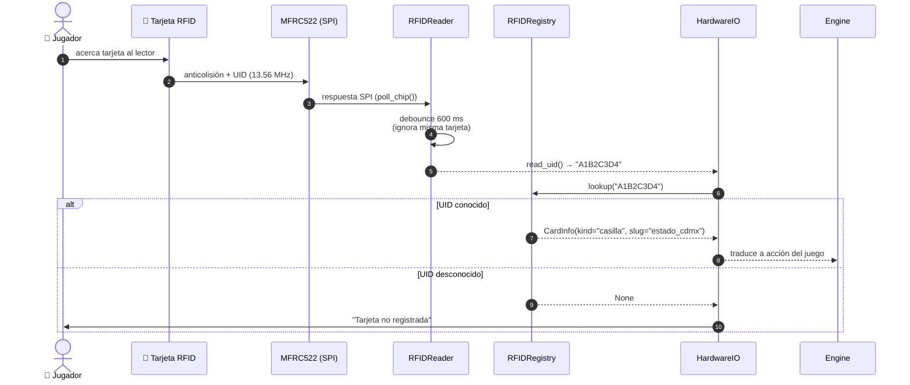
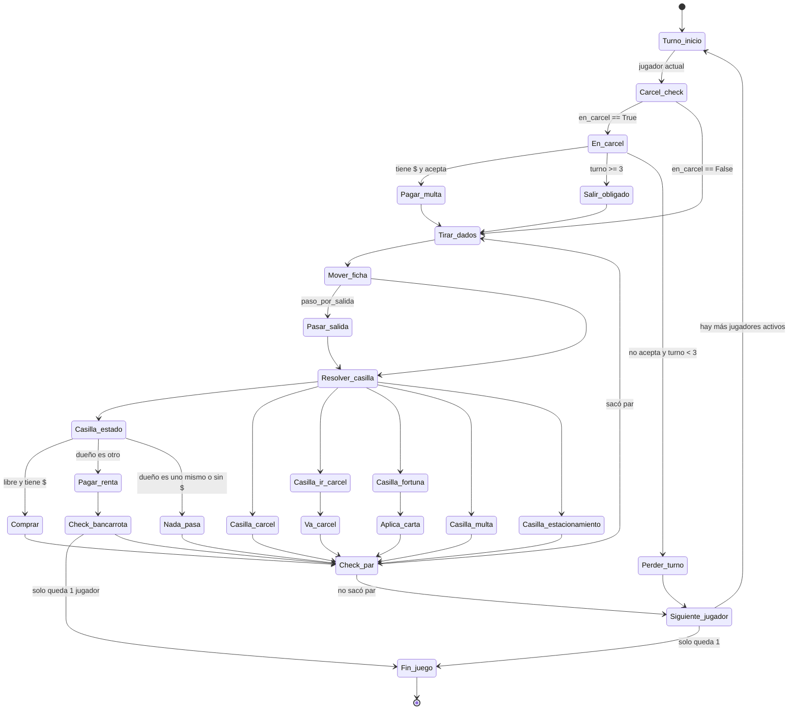

# Arquitectura del sistema

Documentación técnica para desarrolladores que quieran entender, mantener o extender el código de **Turista Mundial Azteca**.

---

## Tabla de contenidos

- [Vista general](#vista-general)
- [Mapa de módulos](#mapa-de-módulos)
- [Pipeline de audio](#pipeline-de-audio)
- [Flujo RFID](#flujo-rfid)
- [State machine del engine](#state-machine-del-engine)
- [Persistencia de estado](#persistencia-de-estado)
- [Patrón plug-and-play en drivers](#patrón-plug-and-play-en-drivers)
- [Cómo extender el sistema](#cómo-extender-el-sistema)
- [Decisiones de diseño](#decisiones-de-diseño)

---

## Vista general

El sistema está dividido en **3 capas independientes**:



**Principio rector:** el engine **no conoce el medio**. Recibe un objeto que cumple el protocolo `IO` (con `show`, `ask_yes_no`, `trigger_dice`, etc.) y un `AudioPlayer`. Eso permite hot-swap entre consola, hardware real, y modo automático sin tocar la lógica de juego.

---

## Mapa de módulos



### Tabla de responsabilidades

| Módulo | Responsabilidad única | Depende de |
|---|---|---|
| `game/config.py` | Parámetros constantes (dinero, multas, slugs) | — |
| `game/models.py` | Dataclasses sin lógica de negocio | `enum`, `dataclasses` |
| `game/board.py` | Construir el tablero canónico de 40 casillas | `models`, `config`, `data.phrases` |
| `game/engine.py` | Reglas y transiciones de estado | `models`, `config`, `audio`, `IO` |
| `game/audio.py` | Cola y reproducción asíncrona de mp3 | `mpg123` (subprocess) |
| `game/state_store.py` | Serialización JSON del `Juego` | `models`, `json` |
| `game/main.py` | Wiring + CLI + selección de IO | todo lo anterior + `drivers` |
| `drivers/dice_button.py` | Abstraer botón GPIO | `gpiozero` (opcional) |
| `drivers/rfid_reader.py` | Abstraer lector MFRC522 | `mfrc522` (opcional) |
| `drivers/rfid_registry.py` | Mapeo persistente UID → entidad | `json` |

---

## Pipeline de audio



**Decisiones clave:**

- **Cola FIFO con un worker thread** → los audios nunca se solapan, pero el engine no se bloquea esperando.
- **`mpg123` por subprocess** en vez de bind nativo (más simple, más robusto a crashes).
- **PipeWire** (no PulseAudio puro) en Pi OS Bookworm+ → emula la API de PulseAudio para apps legacy.
- **BlueZ A2DP profile** se carga vía WirePlumber (drop-in en `~/.config/wireplumber/wireplumber.conf.d/`).

---

## Flujo RFID



### Tipos de entidad registrables

| `kind` | `payload` | Ejemplo |
|---|---|---|
| `"player"` | `{"id": 1\|2}` | Identifica al jugador |
| `"casilla"` | `{"slug": "estado_cdmx"}` | Casilla del tablero |
| `"action"` | `{"name": "comprar"\|"cancelar"\|"si"\|"no"\|"dados"\|"pagar_carcel"}` | Acciones del juego |

El mapeo se guarda en `data/rfid_cards.json` (versionado en git) y se registra interactivamente con `python -m scripts.register_card`.

---

## State machine del engine



---

## Persistencia de estado

El estado del juego se serializa a `data/state.json` después de cada turno:

```json
{
  "jugadores": [
    {"id": 1, "nombre": "Jugador uno", "dinero": 25000, "posicion": 14,
     "propiedades": ["estado_cdmx"], "turnos_en_carcel": 0, "en_carcel": false,
     "bancarrota": false},
    {"id": 2, "nombre": "Jugador dos", "dinero": 32000, "posicion": 7,
     "propiedades": [], "turnos_en_carcel": 0, "en_carcel": false,
     "bancarrota": false}
  ],
  "turno_idx": 0,
  "terminado": false,
  "ganador_id": null,
  "casillas_propietarios": {
    "estado_cdmx": 1
  }
}
```

**Escritura atómica:** `state_store.guardar()` escribe a `state.json.tmp` y luego hace `tmp.replace(state.json)` — garantiza que un crash a media escritura nunca deja el archivo corrupto.

**Reanudación:** al arrancar, `main.py` intenta `state_store.cargar(tablero)`. Si existe, retoma. Si no, crea partida nueva. `--reset` borra el archivo.

---

## Patrón plug-and-play en drivers

Cada driver de hardware sigue el mismo patrón:

```python
class XxxDriver:
    def __init__(self):
        self.available = False
        self._init_hardware()  # try/except, marca available=True si OK

    def _init_hardware(self):
        try:
            import library  # falla en sistemas sin la lib
            self._device = library.Device(...)  # falla si chip ausente
            self.available = True
        except (ImportError, RuntimeError, Exception) as e:
            log.info("XxxDriver no disponible (%s) — fallback consola.", e)

    def main_action(self, allow_console: bool = True):
        if self.available:
            # intenta hardware (no-bloqueante)
            result = self._device.try_read()
            if result: return result
        if allow_console:
            # cae a stdin
            return read_console()
```

**Consecuencia:** el código de juego nunca tiene que checar "¿hay hardware?". Los drivers siempre funcionan, solo que cuando no hay chip físico el polling devuelve siempre `None` y el usuario interactúa por teclado.

`HardwareIO` en `main.py` orquesta esto: hace **race** entre hardware y consola usando `select.select` sobre stdin más polling no-bloqueante del hardware.

---

## Cómo extender el sistema

### Añadir un nuevo tipo de casilla

1. Añade el valor al enum `TipoCasilla` en `game/models.py`.
2. Si tiene audio propio, añádelo a `data/phrases.py` y regenera con `python scripts/generate_tts.py`.
3. Añade el slug a `game/config.py`.
4. Inserta el tipo en `game/board.py` (en `ESPECIALES_POR_POS`).
5. Añade el `if casilla.tipo == TipoCasilla.NUEVA:` en `engine._resolver()`.

### Añadir una nueva carta de fortuna

Solo edita `CARTAS_FORTUNA` en `game/engine.py`. Si requiere efecto especial nuevo (más allá de `delta_dinero` o `ir_a_carcel`), añade un campo al `@dataclass CartaFortuna` y maneja el caso en `_resolver()`.

### Añadir un tercer/cuarto jugador

1. Edita `game/config.py`:
   ```python
   JUGADORES = [
       {"id": 1, "nombre": "Jugador uno"},
       {"id": 2, "nombre": "Jugador dos"},
       {"id": 3, "nombre": "Jugador tres"},
   ]
   AUDIO_TURNO[3] = "turno_jugador_3"
   AUDIO_GANA[3] = "gana_jugador_3"
   ```
2. Añade las frases correspondientes a `data/phrases.py`:
   ```python
   ("turno_jugador_3", "narradora", "Es el turno del jugador tres."),
   ("gana_jugador_3",  "eventos",   "Felicidades, jugador tres. Eres el mejor turista de México."),
   ```
3. Regenera audios.
4. La lógica del engine ya itera sobre `juego.jugadores` (no hay número codificado).

### Implementar hipotecas

En `game/engine._ajustar_dinero()`, antes de marcar bancarrota, ofrecer al jugador hipotecar propiedades por la mitad de su precio de compra. Añadir flag `hipotecada: bool` a `Casilla`.

### Cambiar la duración del juego

- **Más corto:** baja `DINERO_INICIAL` (más bancarrotas rápidas) o sube `COBRO_SALIDA` / `MULTA_IMPUESTOS`.
- **Más largo:** sube `DINERO_INICIAL` o baja `COMPRA_X_HOSPEDAJE` (compras más baratas = más estados disponibles).

### Añadir un display (LED matrix, OLED, e-paper)

Crea `drivers/display.py` con el mismo patrón plug-and-play. Inyéctalo en `HardwareIO` y úsalo en `show()` o en métodos nuevos como `show_money(jugador)`.

---

## Decisiones de diseño

### ¿Por qué `dataclasses` en vez de Pydantic / SQLAlchemy?

El estado del juego es pequeño (<5 KB), no requiere validación compleja ni queries. Dataclasses + JSON manual = cero dependencias extra, latencia mínima, código legible.

### ¿Por qué `mpg123` por subprocess y no `pygame.mixer` o `pydub.playback`?

Probamos. `pygame` arranca un mixer pesado (~100ms), `pydub` depende de un backend externo igualmente. `mpg123` es 1 binario `apt`, 5 MB de RAM, arranca en <30ms.

### ¿Por qué cola FIFO con un worker thread?

Alternativas:
- **Async (`asyncio`)**: choca con `input()` síncrono del IO de consola.
- **Llamada directa bloqueante**: el engine se congela 3-5 seg por cada audio.
- **Threads múltiples**: los audios se solaparían (caos sonoro).

Cola FIFO + 1 worker = nunca solape, nunca bloqueo, fácil de razonar.

### ¿Por qué PipeWire y no PulseAudio?

Raspberry Pi OS Lite Bookworm+ ya viene con PipeWire por default. PulseAudio puro está deprecado en upstream Pi OS. `pipewire-pulse` da compatibilidad con apps que usan API PulseAudio.

### ¿Por qué `gpiozero` y no `RPi.GPIO`?

`RPi.GPIO` clásico tiene bugs conocidos con `add_event_detect` en kernels 6.x (intenta usar `/dev/gpiomem` legacy en vez de `gpiochip`). `gpiozero` con backend `lgpio` es la solución oficial recomendada por Raspberry Pi Foundation desde 2024.

### ¿Por qué `--system-site-packages` en el venv?

`gpiozero` y `lgpio` se instalan vía `apt` (compilados nativamente para el SO). `pip install lgpio` falla por falta de `swig` y no vale la pena instalarlo solo para esto. El venv hereda solo lo necesario; las libs pip-only (edge-tts, pygame, mfrc522) se siguen instalando dentro del venv normalmente.

### ¿Por qué se ignoran `audio/*.mp3` y `data/state.json` en git?

- **`audio/`**: regenerable con un comando (`generate_tts.py`), pesa ~2 MB, no aporta al diff.
- **`data/state.json`**: estado transitorio de una partida; commitearlo contaminaría el historial con cambios cada turno.

`data/rfid_cards.json` **sí** se versiona — describe el set físico de tarjetas del proyecto.

---

[← volver al README](../README.md)
