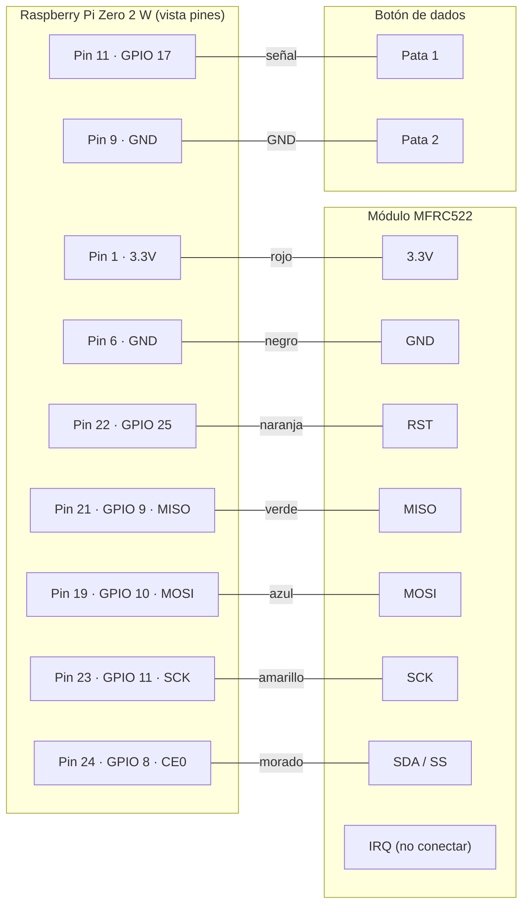

# Guía de hardware

Lista de compras detallada, diagramas de cableado, y ensamblado paso a paso para construir tu propia consola **Turista Mundial Azteca**.

---

## Tabla de contenidos

- [Lista de compras detallada](#lista-de-compras-detallada)
- [Diagrama de conexiones](#diagrama-de-conexiones)
- [Cableado MFRC522 ↔ Raspberry Pi](#cableado-mfrc522--raspberry-pi)
- [Cableado del botón de dados](#cableado-del-botón-de-dados)
- [Pinout de referencia de la Pi](#pinout-de-referencia-de-la-pi)
- [Ensamblado paso a paso](#ensamblado-paso-a-paso)
- [Pruebas de funcionamiento](#pruebas-de-funcionamiento)
- [Solución de problemas](#solución-de-problemas)

---

## Lista de compras detallada

### Esenciales

| Componente | Modelo recomendado | Cant. | Precio aprox. (MXN) | Notas de compra |
|---|---|:-:|---:|---|
| **Raspberry Pi Zero 2 W** | Con headers GPIO **pre-soldados** | 1 | $400 – 700 | Si vienen sin soldar, vas a tener que soldar 40 pines |
| **microSD** | SanDisk Ultra 16 GB Clase 10 | 1 | $100 – 200 | Mínimo 8 GB, 16 GB cómodo, 32 GB de sobra |
| **Adaptador microUSB ↔ USB-A** | OTG, para flashear | 1 | $30 – 60 | Solo si tu lector de SD no es USB |
| **Fuente de poder** | 5 V / 2.5 A microUSB oficial | 1 | $150 – 250 | Subdimensionar = reinicios aleatorios |
| **Bocina Bluetooth** | Mobo Vibe / cualquier marca con A2DP | 1 | $200 – 800 | Importante: A2DP (no solo manos libres) |
| **Módulo MFRC522** | Kit RC522 13.56 MHz | 1 | $80 – 150 | Suele venir con 1 tarjeta + 1 llavero RFID + cables |
| **Tarjetas RFID 13.56 MHz** | MIFARE Classic 1K (formato tarjeta o pegatina) | 40+ | $200 – 400 | Pack de 10 ~$50-100. Necesitas: 32 estados + 2 jugadores + 5 acciones |
| **Pulsador (botón)** | Momentáneo NA (normalmente abierto), 12 mm | 1 | $20 – 50 | Cualquier botón "arcade" o de PCB sirve |
| **Cables jumper hembra-hembra** | 20 cm, mín. 10 piezas | 1 pack | $50 – 100 | Para Pi ↔ MFRC522 (7 cables) |
| **Cables jumper hembra-macho** | 20 cm, mín. 5 piezas | 1 pack | — | Para Pi ↔ botón (2 cables) |
| **microSD card reader USB** | Si tu compu no tiene ranura | 1 | $50 – 100 | Solo si lo necesitas |

**Subtotal esenciales:** ~$1,180 – 2,700 MXN

### Opcionales (mejoran la experiencia)

| Componente | Para qué | Precio aprox. (MXN) |
|---|---|---:|
| **Case para Pi Zero 2 W** | Proteger la placa | $50 – 200 |
| **Tablero impreso a color (60×60 cm)** | Imprenta digital con tu diseño | $150 – 400 |
| **Fichas de juego** | De cualquier Turista clásico viejo o impresas 3D | $0 – 100 |
| **Dinero de juguete** | Opcional si lleva contadores físicos | $0 – 150 |
| **Heat sinks** | Para CPU/RAM si el ambiente es caluroso | $30 – 80 |
| **Soporte para bocina** | Para que el audio salga bien | $50 – 200 |
| **PowerBank** | Si quieres llevarlo a fiestas/escuelas | $300 – 800 |

### Dónde comprar (México)

- **AG Electrónica** (CDMX, online): MFRC522, jumpers, botones
- **Steren** (cadena nacional): cables, fuentes, botones, microSD
- **Amazon México**: todo, suele ser lo más rápido aunque más caro
- **MercadoLibre**: variedad, precios competitivos (verificar reputación del vendedor)
- **Diy Electronics MX, RAM Electronics**: kits Pi
- **Tianguis de electrónica** (varios estados): si tienes tiempo y conocimiento, los mejores precios

---

## Diagrama de conexiones



---

## Cableado MFRC522 ↔ Raspberry Pi

| MFRC522 | Pi BCM | Pi pin físico | Función | Color sugerido del cable |
|---|---|:-:|---|---|
| **VCC** | 3.3V | **1** | Alimentación (¡NO 5V!) | 🔴 rojo |
| **GND** | GND | **6** | Tierra | ⚫ negro |
| **RST** | GPIO 25 | **22** | Reset del chip | 🟠 naranja |
| **MISO** | GPIO 9 | **21** | SPI Master In Slave Out | 🟢 verde |
| **MOSI** | GPIO 10 | **19** | SPI Master Out Slave In | 🔵 azul |
| **SCK** | GPIO 11 | **23** | SPI Clock | 🟡 amarillo |
| **SDA** (SS) | GPIO 8 (CE0) | **24** | SPI Chip Select | 🟣 morado |
| **IRQ** | — | — | _Sin conectar_ | — |

> ⚠️ **Crítico:** Conectar VCC a 5V quema el chip MFRC522. Solo **3.3V**.

---

## Cableado del botón de dados

Cualquier botón momentáneo (NA = normalmente abierto) sirve. Conexión:

| Pata del botón | Pi pin |
|---|---|
| Una pata (cualquiera) | **GPIO 17** (pin físico **11**) |
| Otra pata | **GND** (pin físico **9** o **6**) |

No se necesita resistencia externa — el código habilita el **pull-up interno** del SoC.

```
   ┌──────────┐
   │  Botón   │
   │  ○    ○──│── GPIO 17 (pin 11)
   │  │       │
   └──┼───────┘
      │
      └────── GND (pin 9)
```

Si quieres cambiar el pin, edita en `drivers/dice_button.py`:
```python
DEFAULT_PIN_BCM = 17   # cambia aquí
```

---

## Pinout de referencia de la Pi

```
                              ┌─────────────────┐
                   3.3V  [01] │ ⚪  ⚪ │ [02]  5V
                  GPIO2  [03] │ ⚪  ⚪ │ [04]  5V
                  GPIO3  [05] │ ⚪  ⚪ │ [06]  GND      ← MFRC522 GND
                  GPIO4  [07] │ ⚪  ⚪ │ [08]  GPIO14
                    GND  [09] │ ⚪  ⚪ │ [10]  GPIO15   ← Botón GND
            GPIO17 [11] ★ │ ⚪  ⚪ │ [12]  GPIO18      ← Botón GPIO 17
                 GPIO27  [13] │ ⚪  ⚪ │ [14]  GND
                 GPIO22  [15] │ ⚪  ⚪ │ [16]  GPIO23
                   3.3V  [17] │ ⚪  ⚪ │ [18]  GPIO24
        GPIO10 (MOSI) ★  [19] │ ⚪  ⚪ │ [20]  GND      ← MFRC522 MOSI
         GPIO9 (MISO) ★  [21] │ ⚪  ⚪ │ [22]  GPIO25 ★ ← MFRC522 RST
         GPIO11 (SCK) ★  [23] │ ⚪  ⚪ │ [24]  GPIO8 ★  ← MFRC522 SCK / CE0
                    GND  [25] │ ⚪  ⚪ │ [26]  GPIO7
                  GPIO0  [27] │ ⚪  ⚪ │ [28]  GPIO1
                  GPIO5  [29] │ ⚪  ⚪ │ [30]  GND
                  GPIO6  [31] │ ⚪  ⚪ │ [32]  GPIO12
                 GPIO13  [33] │ ⚪  ⚪ │ [34]  GND
                 GPIO19  [35] │ ⚪  ⚪ │ [36]  GPIO16
                 GPIO26  [37] │ ⚪  ⚪ │ [38]  GPIO20
                    GND  [39] │ ⚪  ⚪ │ [40]  GPIO21
                              └─────────────────┘

★ = pines usados por este proyecto
```

> Pin 1 está marcado con un pequeño triángulo o cuadrado blanco en la placa, generalmente en la esquina cercana a la microSD.

---

## Ensamblado paso a paso

### 1. Preparar la microSD

1. Descarga [Raspberry Pi Imager](https://www.raspberrypi.com/software/) en tu computadora.
2. Selecciona **Raspberry Pi OS Lite 64-bit** (Bookworm/Trixie).
3. Antes de flashear, presiona el ícono de engranaje ⚙️ y configura:
   - Hostname: `Raspiazteca`
   - Usuario: `viajeazteca`, password de tu elección
   - WiFi: tu red 2.4 GHz (el Zero 2 W no tiene 5 GHz)
   - SSH: habilitado con contraseña
4. Flashea la SD.

### 2. Primer arranque

1. Inserta la microSD en la Pi.
2. Conecta la fuente de poder.
3. Espera ~30 seg. Verifica conexión con:
   ```bash
   ssh viajeazteca@raspiazteca.local
   ```

### 3. Habilitar SPI (necesario para MFRC522)

```bash
sudo raspi-config nonint do_spi 0
sudo reboot
# Verificar después del reboot:
ls /dev/spidev*
# Deberías ver: /dev/spidev0.0  /dev/spidev0.1
```

### 4. Cablear el MFRC522

> **Apaga la Pi** (`sudo shutdown -h now`) antes de cablear. Trabajar con la Pi encendida puede freír componentes.

Conecta los 7 cables siguiendo la tabla de arriba. Verifica dos veces que VCC vaya a **3.3V** (pin 1), NO a 5V.

### 5. Cablear el botón

Suelda o usa terminales de conexión rápida en las dos patas del botón. Conecta a GPIO 17 y GND.

### 6. Encender y probar conexiones

```bash
# Vuelve a encender la Pi y conéctate por SSH
ssh viajeazteca@raspiazteca.local

# Verifica que el MFRC522 responde (después de instalar el software)
cd ~/turista && source .venv/bin/activate
python -c "from drivers import RFIDReader; r = RFIDReader(); print('OK' if r.available else 'FAIL')"

# Verifica que el botón responde
python -c "
from drivers import DiceButton
d = DiceButton()
print('Presiona el botón en 10 segundos...')
print(f'Disparado por: {d.wait_for_trigger()}')
"
```

### 7. Emparejar bocina Bluetooth

Sigue las instrucciones en el [README principal](../README.md#4-configurar-la-bocina-bluetooth).

### 8. Generar audios y registrar tarjetas

```bash
python scripts/generate_tts.py              # 65 mp3
python -m scripts.register_card             # registra cada tarjeta una vez
```

### 9. ¡Listo para jugar!

```bash
python -m game.main
```

---

## Pruebas de funcionamiento

Después de ensamblar, corre el script de verificación general:

```bash
~/turista/scripts/verify-bt.sh
```

Y un check específico de drivers:

```bash
cd ~/turista && source .venv/bin/activate && python -c "
from drivers import DiceButton, RFIDReader
print('Dice button:', 'OK' if DiceButton().available else 'FAIL')
print('RFID reader:', 'OK' if RFIDReader().available else 'FAIL')
"
```

Salida esperada:
```
INFO: DiceButton: GPIO 17 (BCM) listo via gpiozero.
INFO: RFIDReader: MFRC522 inicializado.
Dice button: OK
RFID reader: OK
```

---

## Solución de problemas

### ❌ MFRC522 no detecta tarjetas (driver dice OK pero nada al escanear)

1. Verifica voltaje: **debe ser 3.3V**, no 5V.
2. Verifica SPI: `ls /dev/spidev*` debe mostrar dispositivos.
3. Cambia las tarjetas — algunas son de 125 kHz (incompatibles); necesitas **13.56 MHz MIFARE**.
4. Acércala más al módulo (rango efectivo: 2-5 cm).
5. Revisa cableado: MISO/MOSI son fáciles de invertir.

### ❌ Botón no responde

1. Verifica con un multímetro que el botón hace contacto al presionar (continuidad).
2. Confirma que un extremo va a GPIO 17 y el otro a GND.
3. Si usaste otro pin: edita `drivers/dice_button.py` → `DEFAULT_PIN_BCM`.
4. Algunos botones tienen 4 patas — las que están en línea recta horizontal/vertical son las que importan.

### ❌ "Failed to add edge detection" en logs

Usa `gpiozero` + `lgpio` en vez de `RPi.GPIO` clásico (ya implementado en este repo):
```bash
sudo apt install python3-gpiozero python3-lgpio
```
Y asegúrate de que tu venv usa `--system-site-packages` (ver [README](../README.md#3-crear-el-entorno-virtual-con-system-site-packages-para-gpiozero)).

### ❌ Audio se entrecorta o suena con cortes

El Pi Zero 2 W tiene WiFi 2.4 GHz y Bluetooth **compartiendo la misma antena**. Soluciones:
- Conecta la Pi por cable Ethernet (necesitas adaptador USB-OTG)
- Usa red WiFi de 5 GHz si la tienes (la Pi seguirá en 2.4 pero menos congestión)
- Reduce la distancia Pi ↔ bocina
- Cierra apps que usen WiFi durante el juego

### ❌ La Pi se reinicia sola

Fuente de poder débil. Cambia a una de **5V / 2.5A oficial**. Las fuentes de celular viejas suelen dar solo 1-1.5A.

---

[← volver al README](../README.md)
