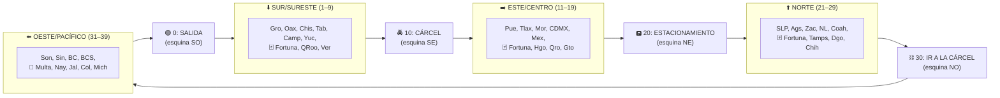
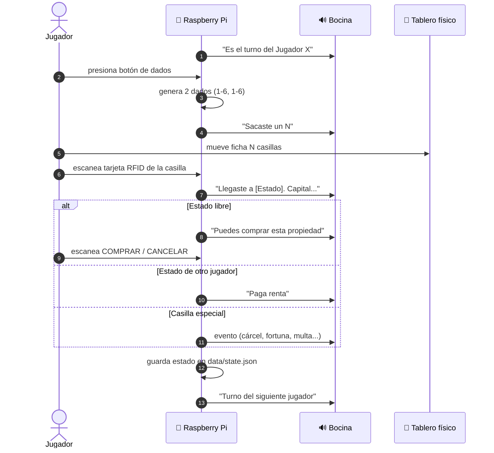
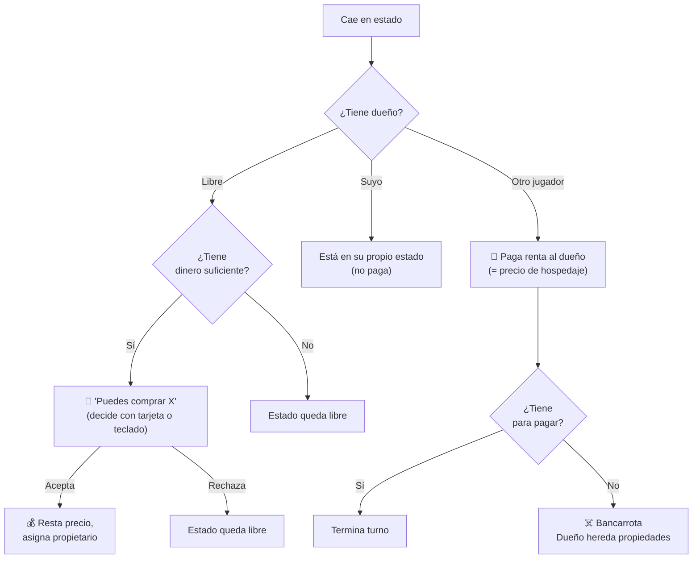
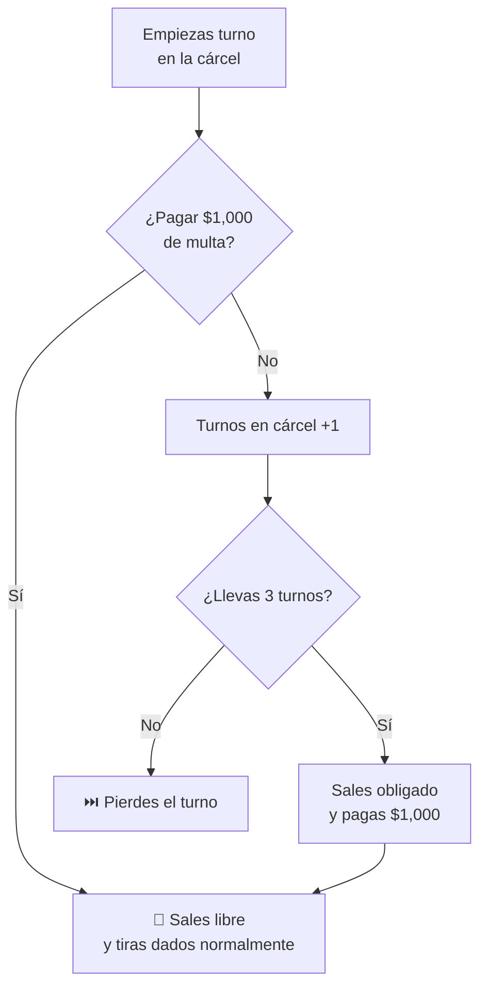
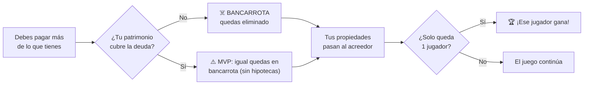

# Cómo jugar Turista Mundial Azteca

Guía completa de reglas para jugadores y maestros. Si solo quieres una idea general, lee primero el [README](../README.md).

---

## Tabla de contenidos

- [Concepto](#concepto)
- [Antes de empezar](#antes-de-empezar)
- [El tablero](#el-tablero)
- [Flujo del turno](#flujo-del-turno)
- [Casillas de estado](#casillas-de-estado)
- [Casillas especiales](#casillas-especiales)
- [Cartas de fortuna](#cartas-de-fortuna)
- [La cárcel](#la-cárcel)
- [Fin del juego: bancarrota](#fin-del-juego-bancarrota)
- [Tabla de precios por estado](#tabla-de-precios-por-estado)
- [Estrategias](#estrategias)
- [FAQ](#faq)

---

## Concepto

Dos jugadores recorren un tablero de 40 casillas que representa los 32 estados de México más espacios especiales (Salida, Cárcel, Estacionamiento Gratis, Ir a la Cárcel, 3 Fortunas, 1 Multa). Cada estado se puede **comprar**, y cuando otro jugador cae ahí, debe **pagar renta** al dueño. Gana el último jugador que quede con dinero.

A diferencia del juego clásico, **la Raspberry Pi narra todo en voz alta** (precios, eventos, llegadas a estados), y los jugadores interactúan con el tablero acercando tarjetas RFID al lector.

---

## Antes de empezar

1. **Enciende la Pi** y la bocina Bluetooth. La auto-conexión tarda ~10 seg.
2. **Verifica que el audio funciona:**
   ```bash
   ~/turista/scripts/verify-bt.sh
   ```
   Deberías escuchar la frase de bienvenida.

3. **Registra las tarjetas RFID** (una sola vez):
   ```bash
   python -m scripts.register_card
   ```
   Necesitarás escanear:
   - **2 tarjetas de jugador** (una para cada jugador)
   - **32 tarjetas de estado** (una por cada estado del tablero)
   - **Tarjetas de acción** (opcional pero recomendado): `comprar`, `cancelar`, `si`, `no`, `pagar_carcel`

4. **Inicia el juego:**
   ```bash
   cd ~/turista && python -m game.main
   ```
   La Pi anuncia la bienvenida y las instrucciones por la bocina.

---

## El tablero

Las casillas están ordenadas en sentido horario, agrupadas geográficamente:



**Total:** 4 esquinas + 32 estados + 3 cartas de fortuna + 1 multa = **40 casillas**.

---

## Flujo del turno



### Dinero inicial

Cada jugador empieza con **$30,000 pesos**.

### Pasar por la Salida

Cada vez que la ficha pasa o cae en la casilla 0 (SALIDA), el jugador cobra **$2,000** del banco.

### Sacar par

Si los dos dados muestran el mismo número, el jugador **tira otra vez** después de resolver la casilla actual. No hay límite de tiradas consecutivas en este MVP (puedes añadir regla de "3 pares = vas a la cárcel" más adelante).

---

## Casillas de estado

Cuando un jugador cae en un estado, ocurre uno de tres escenarios:



**Precio de compra** = precio de hospedaje × **10**. Ejemplo: CDMX cuesta $50,000 comprar; cualquiera que caiga ahí paga $5,000 de renta al dueño.

---

## Casillas especiales

| Casilla | Posición | Efecto |
|---|---|---|
| 🟢 **Salida** | 0 | Cobra $2,000 al pasar o caer |
| 🚔 **Cárcel** | 10 | Si caes aquí estás "solo de visita", no pasa nada |
| 🅿️ **Estacionamiento Gratis** | 20 | Descansa, sin efecto |
| ⛓️ **Ir a la Cárcel** | 30 | Vas directo a la cárcel (no pasas por Salida) |
| 🃏 **Tarjeta de Fortuna** | 7, 16, 26 | Sacas una carta aleatoria (ver abajo) |
| 💸 **Multa de Impuestos** | 35 | Pagas $1,500 al banco |

---

## Cartas de fortuna

Al caer en una casilla de fortuna 🃏, la Pi saca una carta al azar de este mazo:

| # | Carta | Efecto |
|:-:|---|---|
| 1 | 🎂 Cumpleaños | Cobra **+$1,000** del banco |
| 2 | 🎰 Premio de lotería | Cobra **+$2,000** |
| 3 | 💵 Devolución de impuestos | Cobra **+$500** |
| 4 | 🚓 Multa de tránsito | Paga **–$500** al banco |
| 5 | 🔧 Reparación de auto | Paga **–$1,000** |
| 6 | 🏥 Servicio médico | Paga **–$800** |
| 7 | 🚧 Carril contrario | **Va directo a la cárcel** |

---

## La cárcel

Vas a la cárcel cuando:
- Caes en la casilla **30: Ir a la Cárcel**
- Sacas la **carta de fortuna #7** (carril contrario)

Cuando estás en la cárcel:



Mientras estás en la cárcel **no avanzas**, pero los otros jugadores pueden caer en tus propiedades y deberte renta normalmente.

---

## Fin del juego: bancarrota



> **Nota:** El MVP actual no implementa hipotecas. Si no puedes pagar una deuda con tu dinero líquido, quedas en bancarrota aunque tengas propiedades. Esto se puede mejorar más adelante.

---

## Tabla de precios por estado

Los estados están agrupados en 5 niveles de precio:

| Nivel | Renta (hospedaje) | Precio compra | Estados |
|---|--:|--:|---|
| 💎 **Premium** | $5,000 | $50,000 | CDMX · Nuevo León · Jalisco · Quintana Roo |
| ⭐ **Turístico alto** | $3,500 | $35,000 | Yucatán · BCS · Oaxaca · Edo. de México · Puebla · Guanajuato |
| 🔵 **Medio-alto** | $2,500 | $25,000 | Querétaro · Veracruz · Chihuahua · Sonora · Sinaloa · Michoacán · Morelos · BC |
| 🟢 **Medio** | $1,500 | $15,000 | Hidalgo · SLP · Coahuila · Tamaulipas · Aguascalientes · Tabasco · Chiapas · Nayarit |
| ⚪ **Bajo** | $1,000 | $10,000 | Campeche · Colima · Durango · Zacatecas · Tlaxcala · Guerrero |

> Si quieres cambiar los precios, edita `data/phrases.py` (`PRECIOS_HOSPEDAJE`) y luego regenera los audios:
> ```bash
> python scripts/generate_tts.py --only estado_ --force
> ```

---

## Estrategias

- 🎯 **Compra agresivamente en los primeros turnos.** $30,000 iniciales solo alcanzan para 1 estado premium o 3 baratos. Diversificar baratos puede dar más probabilidad de cobrar renta.
- 🏛️ **Premium = alto riesgo, alta recompensa.** CDMX/NL/Jal/QRoo cobran $5,000 de renta pero cuestan $50K (que probablemente no tienes al inicio).
- 🚪 **El centro del tablero es bueno tráfico.** Las casillas cerca de la cárcel y Salida se pisan más porque los jugadores salen de la cárcel hacia ese lado.
- 💰 **Cuida tu liquidez.** Comprar todo y quedarte con $500 te lleva a bancarrota con una sola renta cara.
- 🃏 **Las cartas de fortuna son neutrales en promedio**, pero el "vas a la cárcel" puede arruinar una racha.

---

## FAQ

**P: ¿Necesito tarjetas RFID para jugar?**
R: No. Si arrancas con `python -m game.main --console-only` puedes jugar 100% por teclado. Las tarjetas son para la experiencia física completa.

**P: ¿Se puede pausar y reanudar la partida?**
R: Sí. El estado se guarda automáticamente en `data/state.json` después de cada turno. Al volver a correr `python -m game.main` retoma donde quedaste. Para empezar partida nueva: `python -m game.main --reset`.

**P: ¿Puedo cambiar las voces o el idioma?**
R: Sí. Edita `data/phrases.py` (variable `VOICES`) con cualquier voz de [edge-tts voices](https://github.com/rany2/edge-tts#voices). Después: `python scripts/generate_tts.py --force`.

**P: ¿Cómo añado más jugadores?**
R: El MVP es 2 jugadores. Para 3-4, edita `game/config.py` (lista `JUGADORES`), añade los audios correspondientes en `data/phrases.py` (`AUDIO_TURNO`, `AUDIO_GANA`) y regenera. La lógica del engine ya soporta N jugadores.

**P: La bocina se desconectó a media partida, ¿qué hago?**
R: Acércala más a la Pi (la antena BT/WiFi del Zero 2 W es compartida y débil). Para reconectar: `systemctl --user restart connect-mobo.service`.

**P: ¿Puedo jugar sin internet?**
R: Sí, una vez que los audios MP3 están generados (paso único). El juego corre 100% offline.

---

[← volver al README](../README.md)
